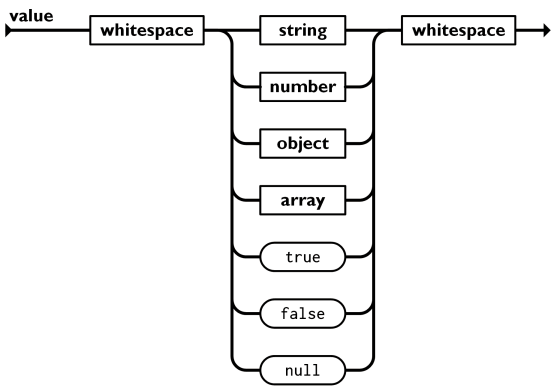
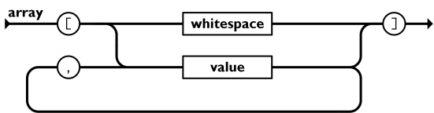
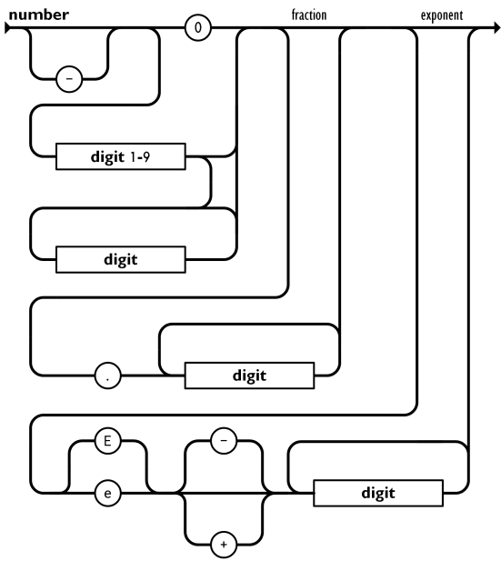
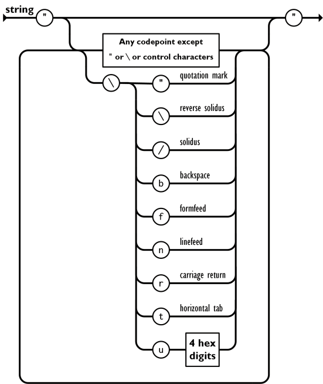

# Streaming JSON Parser

This library contains a small space-efficient parser for JSON documents that
respects the [ECMA 404 (2nd edition, december 2017)](https://www.ecma-international.org/wp-content/uploads/ECMA-404_2nd_edition_december_2017.pdf)
standard.

## Motivation

I was working on a project that required to parse rather large JSON documents
on an Arduino. While there are perfectly fine streaming parser out there
(Eichhorn, mrfaptastic, Bodmer), these libraries where not exactly what I wanted.
Moreover, json-streaming-parser-2 and JSON_Decoder both are forks of
json-streaming-parser.
With these libraries, I have also found some parsing issues and the repositories do not seem
particularly active. Now I must admit, I'm not very persistent when it comes to
maintaining projects myself, so this one's not going to see much love at some
point as well and I'm not going to criticize anyone for that, but still...
Last but not least, I had more pressing tasks to attend to and in the spirit
of procrastination (and maybe learning something I guess) I decided to tackle
a JSON parser myself.

While loading the full JSON document into RAM on my particular project is not feasible, I want to mention at this point the fantastic libary [ArduinoJson](https://arduinojson.org/). In the extremely unlikely case, that you found this repository first, you might want to consider choosing that library. Is really convenient to work with and is also very efficient, both computationally and storage-wise.

My goal for this parser was on the one hand, to make its memory footprint as small as possible.
Furthermore, I wanted to implement unit tests to actually be more confident,
that the parser works properly.
Regarding functionalities, I wanted to

* Have the parser report on errors (i.e. call an overridable `on_error` method). *(done)*
* Build the parser such that it follows ECMA 404. *(partially done: some aspects of unicode parsing still need some work)*
* Configurability:
	- The ability to switch on/off certain callbacks. *(done)*
	- Several different number parsing strategies (the parser now follows the rules outlines in ECMA 404, but simpler strategies where the scientific notation is disregarded for the sake of higher performance for instance might be useful) *(todo)*
* Thorough testing. *(partially done)*
* Integration with the Arduino `Stream` class. *(todo)*
* Compile-time configurable maximal nesting depth and sting lengths, in order to avoid dynamic memory allocations. *(done)*
* Optional overflow/underflow/loss of significance detection and reporting. *(partially done)*
* Minimal dependencies: The code should not depend on any Arduino-specific code oder other libraries. At the time of writing this readme, the library only depends on the standard headers:
	- `stdint.h` (for integer definitions)
	- `stdlib.h` (for `size_t`)
	- `limits.h` (if overflow checking is enabled)
	- `math.h` (if overflow checking is enabled)
	- `float.h` (if overflow checking is enabled)
* Optional single header build for quick and easy integration into any project. *(todo)*

## Parser details

Let us recall here the rules from the ECMA 404 standard as flowcharts (see the PDF):

### value


### object


### array


### number


### string


## Documentation

### Proprocessor flags

Using several defines, you can switch on/off certain aspects of the library to selectively add/remove parts of the code and optimize it for your needs. The flags can be switched of by commenting out or removing the respective lines in `JSONConfig.h` or set the respective compiler flags. The following flags are available:

* **JSONSTREAM_ACT_ON_DOCUMENT_BEGIN**: Trigger the callback method `on_document_begin` if the document begins.
* **JSONSTREAM_ACT_ON_DOCUMENT_END**: Same as for document begin, but for when the document ends. This callback does in any case not trigger if there was some error during parsing the document.
* **JSONSTREAM_ACT_ON_OBJECT_BEGIN**: Trigger the `on_object_begin` callback each time a `{` is encounterd.
* **JSONSTREAM_ACT_ON_OBJECT_END**: Trigger the `on_object_end` callback each time a `}` is encounterd.
* **JSONSTREAM_ACT_ON_OBJECT_EMPTY**: Trigger the `on_object_empty` callback if the object that just closed is empty, i.e. does not contain any keys.
* **JSONSTREAM_ACT_ON_ARRAY_BEGIN**: Same as for JSONSTREAM_ACT_ON_OBJECT_BEGIN but for `[`.
* **JSONSTREAM_ACT_ON_ARRAY_END**: Same as for JSONSTREAM_ACT_ON_OBJECT_END but for `]`.
* **JSONSTREAM_ACT_ON_ARRAY_EMPTY**: Trigger the `on_array_empty` callback if the array that just closed is empty, i.e. does not contain any values.
* **JSONSTREAM_ONLY_FLOAT_NUMBERS**: Always interpret number as floating point number. In this case, the `on_integer` function does not need to be implemented.
* **JSONSTREAM_CHECK_OVERFLOWS**: Enable overflow/underflow protection for integers and floats. If an overflow/underflow was detected, `on_error` is called and the document is marked as invalid.
* **JSONSTREAM_CHECK_LOSS_OF_SIGNIFICANCE**: If there are two many decimal places, the number cannot be represented by a float anymore. If this is defined, the parser will fail if a number cannot be represented as a float anymore and on_error will be called.
* **JSONSTREAM_MAX_DEPTH 10**: Maximal number of nested elements.
* **JSONSTREAM_BUFFER_LIMIT 100**: Maximal number of bytes a string or key can have.
* **JSONSTREAM_CERR_ERROR_MSG**: Print an error message to `cerr` (for development and debugging).

The core elements of the library are the two classes `RawParser` and `Parser`. The difference between the two is that the latter parses values (float, boolean) and passes them on to the respective callback function while the former always passes on the unparsed strings. `Parser` is derived from `RawParser`.

Depending on whether you want to receive all values as strings or parse them as well, create a new class that then implements the callback functions accordingly:

### Extension of `RawParser`

```c++
class MyRawParser : public json::RawParser {
public:
	// only if JSONSTREAM_ACT_ON_DOCUMENT_BEGIN is defined
    void on_document_begin(json::Type type) override {
		...
    }

	// only if JSONSTREAM_ACT_ON_DOCUMENT_END is defined
    void on_document_end(json::Type type) override {
		...
    }

	// only if JSONSTREAM_ACT_ON_ARRAY_BEGIN is defined
    void on_array_begin(const json::Path& path) override {
		...
    }

	// only if JSONSTREAM_ACT_ON_ARRAY_EMPTY is defined
    void on_array_empty(const json::Path& path) override {
		...
    }

	// only if JSONSTREAM_ACT_ON_ARRAY_END is defined
    void on_array_end(const json::Path& path) override {
		...
    }

	// only if JSONSTREAM_ACT_ON_OBJECT_BEGIN is defined
    void on_object_begin(const json::Path& path) override {
		...
    }

	// only if JSONSTREAM_ACT_ON_OBJECT_EMPTY is defined
    void on_object_empty(const json::Path& path) override {
		...
    }

	// only if JSONSTREAM_ACT_ON_OBJECT_END is defined
    void on_object_end(const json::Path& path) override {
		...
    }

    void on_string(const json::Path& path, const char *value) override {
		...
    }

    void on_number(const json::Path& path, const char *value) override {
		...
    }

    void on_true(const json::Path& path) override {
		...
    }

    void on_false(const json::Path& path) override {
		...
    }

    void on_null(const json::Path& path) override {
		...
    }

    void on_error(const json::ErrorCode error_code) override {
        ...
    }
};
```

### Extension of `Parser`

```c++
class MyParser : public json::Parser {
public:
	// only if JSONSTREAM_ACT_ON_DOCUMENT_BEGIN is defined
    void on_document_begin(json::Type type) override {
		...
    }

	// only if JSONSTREAM_ACT_ON_DOCUMENT_END is defined
    void on_document_end(json::Type type) override {
		...
    }

	// only if JSONSTREAM_ACT_ON_ARRAY_BEGIN is defined
    void on_array_begin(const json::Path& path) override {
		...
    }

	// only if JSONSTREAM_ACT_ON_ARRAY_EMPTY is defined
    void on_array_empty(const json::Path& path) override {
		...
    }

	// only if JSONSTREAM_ACT_ON_ARRAY_END is defined
    void on_array_end(const json::Path& path) override {
		...
    }

	// only if JSONSTREAM_ACT_ON_OBJECT_BEGIN is defined
    void on_object_begin(const json::Path& path) override {
		...
    }

	// only if JSONSTREAM_ACT_ON_OBJECT_EMPTY is defined
    void on_object_empty(const json::Path& path) override {
		...
    }

	// only if JSONSTREAM_ACT_ON_OBJECT_END is defined
    void on_object_end(const json::Path& path) override {
		...
    }

    void on_string(const json::Path& path, const char *value) override {
		...
    }

	// only if JSONSTREAM_ONLY_FLOAT_NUMBERS is *not* defined
    void on_integer(const json::Path& path, int value) override {
		...
    }

    void on_boolean(const json::Path& path, bool value) override {
		...
    }

    void on_float(const json::Path& path, float value) override {
		...
    }

    void on_null(const json::Path& path) override {
		...
    }

    void on_error(const json::ErrorCode error_code) override {
        ...
    }
};
```

## Paths

TBA

## Examples

TBA

## References

1) *The JSON data interchange syntax* (2017), 2nd edition: https://www.ecma-international.org/publications-and-standards/standards/ecma-404/
2) Eichhorn Daniel, *json-streaming-parser*, GitHub repository: https://github.com/squix78/json-streaming-parser
3) mrfaptastic, *json-streaming-parser-2*, GitHub repository: https://github.com/mrfaptastic/json-streaming-parser2
4) Bodmer, *JSON_Decoder*, GitHub repository: https://github.com/Bodmer/JSON_Decoder
5) Blanchon Benoît, *ArduinoJson*, GitHub repository: https://github.com/bblanchon/ArduinoJson
